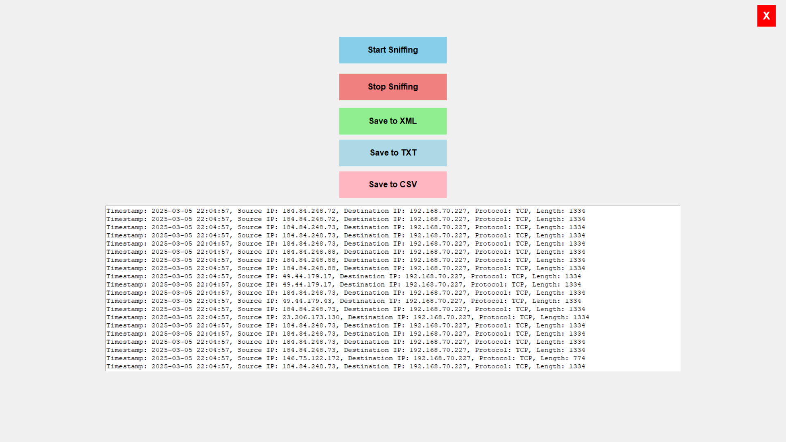
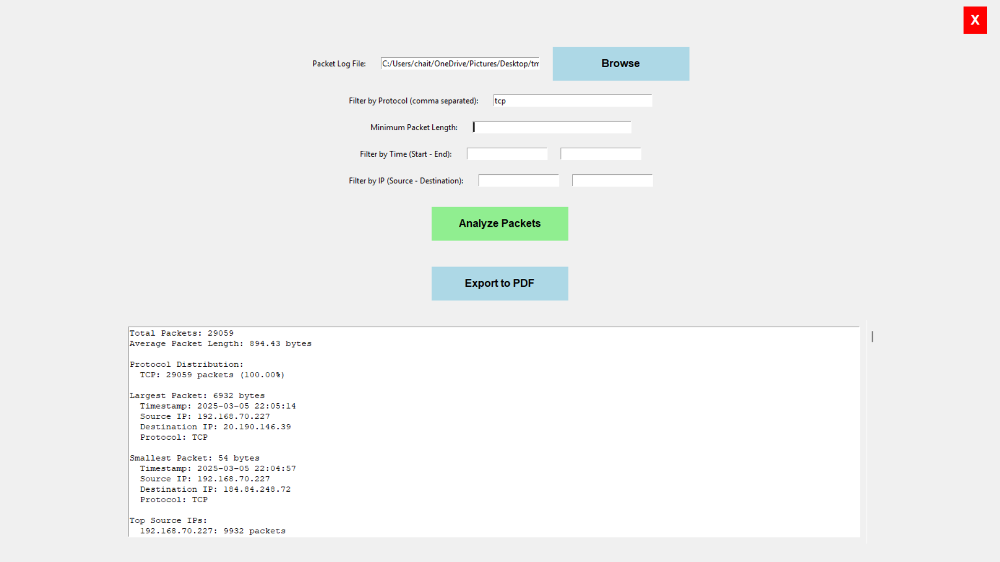

# PacketX

## Advanced Real-Time Packet Sniffing & Network Traffic Analyzer

PacketX is a Python-based desktop application developed for real-time packet sniffing, packet monitoring, and network traffic analysis.  
The project combines a live packet sniffer and an intelligent packet analyzer into a single lightweight GUI application.

Built using Python, Tkinter, and Scapy, PacketX provides an interactive environment for capturing, filtering, analyzing, and exporting network packet data.

---

# Features

## Packet Sniffer

- Real-time packet capture
- Live network traffic monitoring
- Displays:
  - Timestamp
  - Source IP
  - Destination IP
  - Protocol
  - Packet Length
- Supports multiple protocols:
  - TCP
  - UDP
  - ICMP
  - ARP
  - ICMPv6
  - OSPF
  - VRRP
  - PPTP
- Export packet logs to:
  - TXT
  - CSV
  - XML

---

## Packet Analyzer

- Analyze saved packet logs
- Filter by protocol
- Filter by packet length
- Filter by time range
- Filter by source IP
- Filter by destination IP
- Protocol distribution analysis
- Largest and smallest packet detection
- Average packet size calculation
- Top source and destination IP statistics
- Export analysis reports to PDF

---

# GUI Overview

- Fullscreen modern interface
- Dedicated Sniffer and Analyzer modules
- Clean and minimal layout
- Scrollable packet output display
- Interactive filtering system

---

# Project Structure

```bash
PacketX/
│
├── main.py
├── sniffer.py
├── analyzer.py
├── app.bat
│
├── 1IMG.png
├── 2IMG.png
├── 3IMG.png
│
└── README.md
```

---

# Screenshots

## Main Landing Page


---

## Packet Sniffer Window



---

## Packet Analyzer Window



---

# Technologies Used

| Technology | Purpose |
|------------|----------|
| Python | Core Development |
| Tkinter | GUI Framework |
| Scapy | Packet Sniffing |
| Pandas | Data Handling |
| FPDF | PDF Report Export |
| XML/CSV | Packet Storage |

---

# Installation

## Clone Repository

```bash
git clone https://github.com/yourusername/PacketX.git
cd PacketX
```

---

## Install Dependencies

```bash
pip install scapy pandas fpdf
```

---

# Running the Application

## Using Python

```bash
python main.py
```

---

## Using Batch File

```bash
app.bat
```

---

# Working Principle

## Packet Sniffing Module

The sniffer captures packets directly from the active network interface using Scapy.

For each captured packet:
- Timestamp is recorded
- Source and destination IPs are extracted
- Protocol type is identified
- Packet size is calculated

Captured packets are displayed live inside the GUI.

---

## Packet Analyzer Module

The analyzer reads saved packet logs and performs:
- Protocol analysis
- Traffic filtering
- Packet statistics generation
- IP analysis
- PDF report generation

---

# Export Formats

| Format | Supported |
|--------|-----------|
| TXT | Yes |
| CSV | Yes |
| XML | Yes |
| PDF | Yes |

---

# Example Output

```text
Total Packets: 29059
Average Packet Length: 894.43 bytes

Protocol Distribution:
TCP: 29059 packets (100.00%)

Largest Packet: 6932 bytes
Smallest Packet: 54 bytes

Top Source IPs:
192.168.70.227 : 9932 packets
```

---

# Requirements

- Python 3.9+
- Windows/Linux
- Administrator privileges recommended

---

# Future Improvements

- Dark Mode UI
- Live traffic visualization
- PCAP file support
- Suspicious traffic alerts
- Search functionality
- Packet payload viewer
- Advanced filtering
- Multi-thread optimization

---

# Use Cases

- Cybersecurity learning
- Educational packet analysis
- Network traffic monitoring
- Networking experiments
- Packet inspection practice

---

# Security Notice

This project is intended only for:
- Educational purposes
- Authorized network monitoring
- Ethical cybersecurity research

Do not use this application on networks without permission.

---

# Repository Tags

```text
python
packet-sniffer
packet-analyzer
network-security
cybersecurity
scapy
tkinter
traffic-analysis
network-monitoring
```

---

# License

MIT License

---

# Acknowledgements

- Python
- Scapy
- Tkinter
- Open-source networking community
